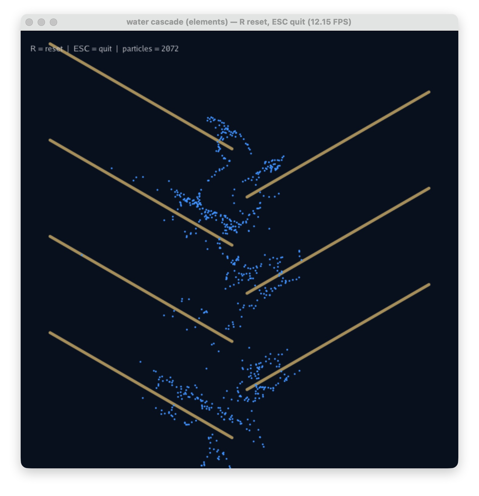

# Taichi Play

一组用 Taichi 实现的 2D 物理模拟 demo，从离散刚体到 MPM 多材料流体。

## 依赖

- Python 3.12+
- taichi 1.7.4
- numpy
- uv

## Demo 列表

### 1. `ball_physics.py` —— 离散小球瀑布级联

300 个小球从顶部掉落，经过 7 层 30° 交错斜板，沿斜板滑落、从缝隙掉到下一层，最终掉出画面自动删除。

- 物理：线段碰撞检测 + 球-球弹性碰撞（O(n²) pairwise）
- 渲染：3D GGUI，斜板用木色 mesh

```bash
uv run python ball_physics.py
```

### 2. `water_mpm.py` —— 最小可跑的 2D MPM 水

88 行级别的极简 MPM 演示，无挡板。8192 个粒子从顶部一团掉下来，撞到地面、墙壁、自身翻滚堆积。用来学习 P2G / grid update / G2P 三步循环。

- 物理：APIC + 弱可压缩水（只追 J）
- 没有邻居查找，背景网格处理一切

```bash
uv run python water_mpm.py
```

### 3. `water_cascade.py` —— MPM 水 + 瀑布级联 + 实时 GUI

把 `water_mpm.py` 和 `ball_physics.py` 拼起来：MPM 水流过 7 层 30° 挡板。运行时窗口左上有 GUI 面板：

- 4 个材料预设按钮（`water` / `honey` / `splash` / `mud`）一键切换
- 4 个滑条（`gravity` / `E` / `FRIC` / `substeps`）实时调
- `reset particles` 按钮重洒粒子

```bash
uv run python water_cascade.py
```

### 4. `try_elements_2d.py` —— taichi-elements 2D（外部库对照实验）

用官方 `taichi-elements` 库做同样的事，对比"自己写"和"用库"的差异。**需要先 clone 库**：

```bash
git clone https://github.com/taichi-dev/taichi_elements ~/code/taichi_elements
```

如果路径不是 `~/code/taichi_elements`，要改 `try_elements_2d.py` 顶部的 `ELEMENTS_PATH`。

```bash
uv run --with taichi python try_elements_2d.py
```

操作：

- **R** 键：重置场景（水/jelly/沙重新掉下来）
- **ESC** 键：退出

⚠️ Mac 兼容性：

- Metal 后端不支持 `Pointer SNode`（稀疏网格），代码里强制用 `ti.cpu` 后端
- 启动有一堆 `int32 implicit cast` 警告，是 Taichi 0.8 → 1.7 API 漂移留下的，不致命

### 5. `water_cascade_elements.py` —— taichi-elements 版的瀑布级联

把 `water_cascade.py` 的场景（7 层挡板）用 `taichi-elements` 重写一遍。比我们手写版的水**更像真水**：手写版 `E=400` 看起来像浆糊，elements 默认 `E=1e6` 才是真水级的不可压缩流体。



关键设计：

- **挡板**：库的 `add_surface_collider` 只能做无限半平面，做不出有限长挡板。改用 `add_sphere_collider(surface_slip)` 沿挡板线段串一串小球（63 个 collider）
- **批量 collider 优化**：原生 API 给每个球注册一个独立 `ti.kernel`，CPU 上 90+ 次 kernel 启动直接卡到个位数 FPS。我们手写一个 batched kernel，把所有球的 SDF 检查塞进一次网格遍历，FPS 提升 5-10 倍
- **流出屏幕**：`unbounded=True` 让水飞出 `[0,1]` 后自动消失
- **每 5 秒喷一坨水**（墙钟时间，不是帧数）

```bash
# 同样需要先 clone taichi_elements 到 ~/code/taichi_elements
uv run --with taichi python water_cascade_elements.py
```

操作：**R** 重置场景 | **ESC** 退出

## Demo 之间的对比

| Demo | 算法 | 粒子数 | 关键代码量 | 适用 |
|---|---|---|---|---|
| `ball_physics.py` | 离散刚体 | ~300 | ~270 行 | 学习碰撞 / 离散物理 |
| `water_mpm.py` | MPM | 8192 | ~110 行 | 学习 MPM 最小骨架 |
| `water_cascade.py` | MPM + 挡板 + GUI | 10000 | ~230 行 | 实战、调参、出效果（看起来像浆糊）|
| `try_elements_2d.py` | MPM（外部库）| 自动 | ~80 行 | 看高层库怎么封装 |
| `water_cascade_elements.py` | MPM（外部库）+ 挡板 | ~3000 | ~150 行 | 真水视觉效果，性能受 CPU 限 |

## Prompt 实现方式（`ball_physics.py`）

```
用 taichi 做一个 2D 小球物理模拟：
- 球从顶部掉落，约每秒 5 个
- 7 层 30° 交错斜板，边缘在中间相接，形成瀑布级联
- 球沿斜板滑落，从缝隙掉到下一层，最终掉出画面自动删除
- 斜板用 mesh 渲染为木色填充矩形
- 纯 2D 物理（线段碰撞检测），无顶板底板
- 固定相机正对 XY 平面
```
